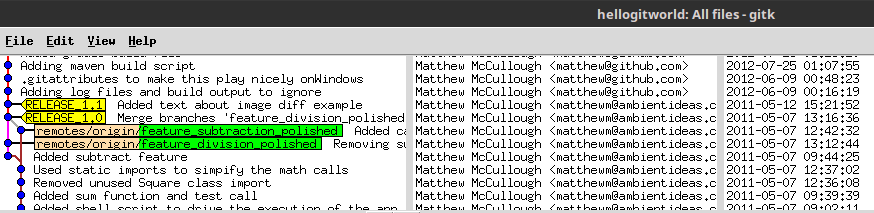
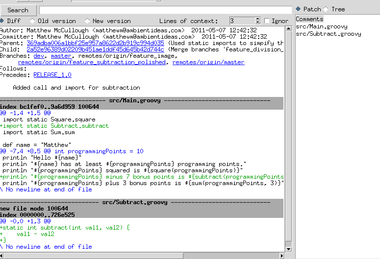
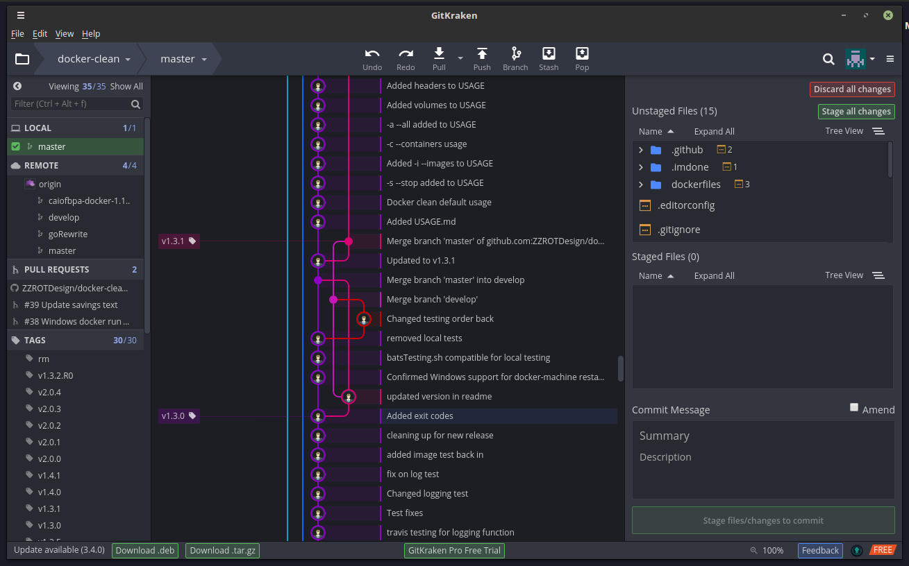

.. _using_branches:

==============
Using Branches
==============

.. highlight:: console

Branches in git are similar to branches in CVS and SVN, but they are also a little different. In CVS and SVN, a branch was effectively a separate commit stream - each commit in one branch is independent of any commits made in another branch. Git doesn't have separate commit streams; it's as if the branches are just subfolders of the overal project, and every commit includes everything in the repository. A lot of git tools will visualize the branches as vertical lines that are separate when the branches have differences, but the lines will come together when the branches become the same because of a merge:

.. figure:: _static/images/git_branch_history.png

Dots on the lines represent points at which a commit was made, and branches that don't have any changes at a given commit will not have a dot at that horizontal location. Branches may be displayed as stopping in the past (the last commit made on that branch was a while ago), but if a commit is made on that branch later on, the line will be extended up to the point where the commit was made. Two branches that were merged effectively look like a single line, but if there is a change made to one of the branches but not the other, the two lines will diverge.

The Master Branch
=================

A new repository is always created with a default **master** branch. Most git methodologies consider the master branch to be production-ready and therefore it should not be the branch where main day-to-day development occurs. Instead, developers should always create a development branch and then when the development of a feature is done and tested, the changes are merged over from the development branch to the master.

Creating a New Branch
=====================

To create a new branch, you execute the **branch** command::

  $ git branch dev
  $ git branch
    dev
  * master

As you can see, running the **branch** command without any arguments will list the existing branches.

Switching Branches
==================

To switch to a different branch, you use the **checkout** command::

  $ git checkout dev
  Switched to branch 'dev'

Note that when you issue a **checkout** command, it will replace the working copy with the version on the branch. For example, imagine that I had a LICENSE file on my dev branch, but not on master. If I switch to master, that file will disappear::

  $ ls
  build.gradle  fix.txt  LICENSE  pom.xml  README.txt  resources  runme.sh  src
  $ git checkout master
  Switched to branch 'master'
  Your branch is up-to-date with 'origin/master'.
  $ ls
  build.gradle  fix.txt  pom.xml  README.txt  resources  runme.sh  src

Fortunately, if there are any modifications in the working copy, git will tell you that you need to either commit the changes or stash them before switching branches::

  $ vi LICENSE
  $ git checkout master
  error: Your local changes to the following files would be overwritten by checkout:
  	LICENSE
  Please, commit your changes or stash them before you can switch branches.
  Aborting

Another thing to note is that if you add a file to the working set and then switch branches, that file can remain in the working set if the change is logical on the new branch (for example, adding a new file)::

  $ git checkout master
  Switched to branch 'master'
  Your branch is up-to-date with 'origin/master'.
  $ ls
  build.gradle  fix.txt  pom.xml  README.txt  resources  runme.sh  src
  $ vi versions.txt
  $ git add versions.txt
  $ git checkout dev
  A	versions.txt
  Switched to branch 'dev'
  $ git status
  On branch dev
  Changes to be committed:
    (use "git reset HEAD <file>..." to unstage)

  	new file:   versions.txt

If, however, the change would not logically make sense on the new branch (such as changes to a file that doesn't exist on the new branch), git will tell you to commit or stash the change first (LICENSE exists in the dev branch but doesn't exist in master)::

  $ git checkout dev
  Switched to branch 'dev'
  $ vi LICENSE
  $ git add LICENSE
  $ git checkout master
  error: Your local changes to the following files would be overwritten by checkout:
  	  LICENSE
  Please, commit your changes or stash them before you can switch branches.
  Aborting

Merging Changes Between Branches
================================

To merge changes from one branch to another, you use the **merge** command. For example, if I had added several files to my **dev** branch and wanted to bring them to the **master** branch, you would checkout the master branch and then run the merge command like this::

  $ git merge dev
  Updating ef7bebf..e4007d8
  Fast-forward
   LICENSE             | 1 +
   README.txt          | 2 --
   fix.txt             | 1 +
   pom.xml             | 2 ++
   runme.sh            | 3 ++-
   src/Circle.groovy   | 1 +
   src/Triangle.groovy | 1 +
   versions.txt        | 1 +
   8 files changed, 9 insertions(+), 3 deletions(-)
   create mode 100644 LICENSE
   create mode 100644 src/Circle.groovy
   create mode 100644 src/Triangle.groovy
   create mode 100644 versions.txt

You will notice that git used a **Fast-forward** approach on this merge. If the source branch was created at an ancestral point of the target branch and there were no other changes to the target branch before the merge (in this case, I branched and then made changes to the dev branch while master sat idle), adding the changes from the source branch would effectively just be like applying the commits from the source branch to the current branch. In this case, git effectively rearranges the commits and doesn't create a merge commit. If you look at a visual representation of the two branches, it will effectively look like they are just a single series of changes and both branch pointers point to the most recent change. If a fast-forward is not possible due to intervening changes or the user requests to not use a fast-forward, the changes are effectively merged into a new commit on the target branch.

Visualizing Branches
====================

As you saw at the beginning of this section, branches can start to get a little confusing if you are looking at them in a **log** command because the commits are all one stream. Fortunately a lot of visual tools exist to help clear this up. One such tool is **gitk**, which allows you to browse the entire history of the repository. The top part of the application has three columns: the commit stream and messages, who made the commit, and the date/time of the commit.

The bottom part has the details of the commit selected in the top including what files were changed, a diff output of the changes, and other details such as what branches had changes as part of the commit.

The gitk tool is only a visualizer. Other tools let you do all the git operations. One of my favorites is `GitKraken <http://www.gitkraken.com>`_:

